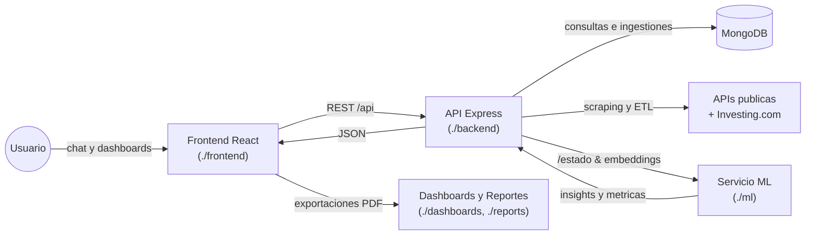
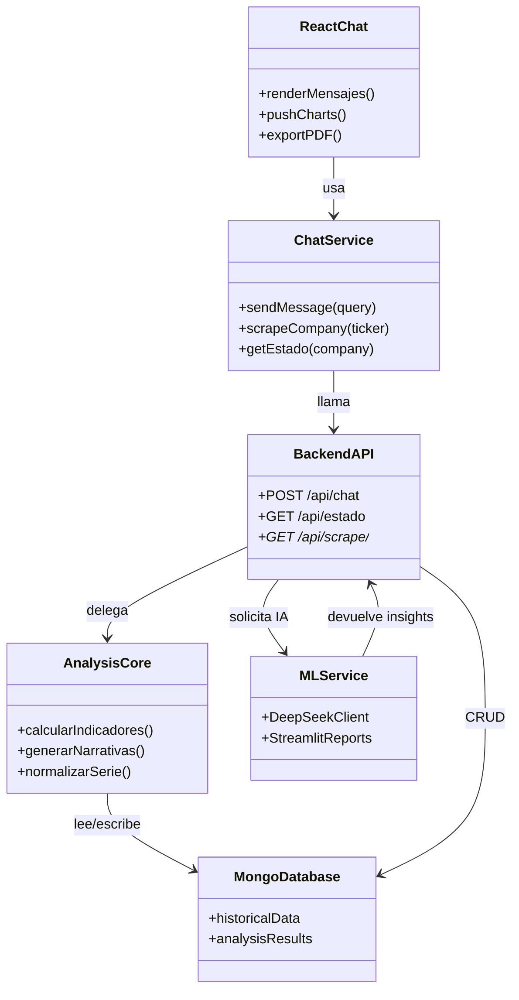

# TP Final Base de Datos · Plataforma de Análisis Financiero con IA

[](https://react.dev/) [](https://www.typescriptlang.org/) [](https://nodejs.org/) [](https://expressjs.com/) [](https://www.mongodb.com/) [](https://www.python.org/) 

> Plataforma full-stack (React + Node + MongoDB + ML en Python) capaz de responder en lenguaje natural, ejecutar scraping financiero avanzado, generar reportes cuantitativos y exportar conversaciones completas.

## Tabla de contenidos

- [Vision general](#vision-general)
- [Casos de uso destacados](#casos-de-uso-destacados)
- [Caracteristicas clave](#caracteristicas-clave)
- [Arquitectura](#arquitectura)
- [Estructura del repositorio](#estructura-del-repositorio)
- [Stack tecnologico](#stack-tecnologico)
- [Configuracion rapida](#configuracion-rapida)
- [Variables de entorno](#variables-de-entorno)
- [Scripts por modulo](#scripts-por-modulo)
- [API REST disponible](#api-rest-disponible)
- [Comandos disponibles en el chat](#comandos-disponibles-en-el-chat)
- [Flujo de generacion de insights](#flujo-de-generacion-de-insights)
- [Testing y calidad](#testing-y-calidad)
- [Roadmap inmediato](#roadmap-inmediato)

## Vision general

Trabajo práctico final de Base de Datos que combina scraping financiero, almacenamiento NoSQL y modelos de lenguaje para asistir a analistas. El usuario conversa con un asistente que puede consultar historiales, calcular indicadores técnicos, pedir reportes narrativos al LLM DeepSeek y mostrar gráficos listos para imprimir o exportar.

## Casos de uso destacados

- Analizar una compañía con `/estado <ticker>` y obtener series OHLC, medias móviles y narrativa IA.
- Ejecutar `/analiza <compañía>` para disparar scraping desde Investing.com y persistir el histórico más reciente.
- Pedir comparaciones rápidas (`/compara A y B`), gráficos específicos (`/graficos <compañía>`) o ayuda (`/help`).
- Exportar cualquier conversación a PDF con tablas, métricas y gráficos embebidos para compartir con el equipo.
- Cargar el módulo `ml/` para experimentar con modelos Prophet/LSTM y reportes en Streamlit.

## Caracteristicas clave

**Chat IA contextual** – `frontend/src/components/Chat.tsx` consume `chatService` para enviar prompts al backend y formatea las respuestas con Markdown, indicadores y alertas de rate limiting.

**Scraping resiliente** – `backend/src/app.ts` usa Puppeteer + Stealth Plugin con fallback opcional a Selenium para lidiar con Investing.com. Extrae tanto HTML como payload JSON (`__NEXT_DATA__`).

**Persistencia flexible** – `backend/src/db.ts` conecta a MongoDB para almacenar análisis, historiales y resultados de scraping. Incluye normalización y vectorización (HuggingFace + fallback local) para búsquedas semánticas.

**Visualizaciones listas** – Componentes en `frontend/src/components/charts` generan line, area, bar, pie y candlestick charts (Recharts) a partir de la respuesta del backend.

**Reportes y exportación** – `frontend/src/components/ExportChatButton.tsx` utiliza `html2pdf.js` para convertir el chat completo en PDF con sello temporal y metadatos.

**Módulo ML** – `ml/main.py` + Streamlit ofrecen un asistente alternativo y plantillas para entrenar modelos de series temporales o generar informes PDF/XLSX mediante Python.

## Arquitectura



- **Frontend**: SPA en React + TypeScript con Bootstrap, chat persistente y componentes para métricas (`FinancialIndicatorsCard.tsx`).
- **Backend**: Express + TypeScript expone `/api/chat`, `/api/estado` y endpoints de scraping; integra DeepSeek, HuggingFace y Mongo.
- **ML/Streamlit**: módulo Python independiente para experimentos, reportes avanzados y pruebas rápidas de prompts.
- **Dashboards & Reports**: guías para notebooks/Streamlit adicionales y reportes descargables.

## UML



El diagrama resume cómo el chat en React coordina solicitudes al `chatService`, el cual consume la API Express. Esta API central distribuye responsabilidades entre el núcleo de análisis, MongoDB y el módulo de IA/ML para entregar respuestas enriquecidas.

## Estructura del repositorio

```text
.
├── backend/              # API Express + scraping + Mongo
│   ├── src/app.ts        # Rutas REST y lógica de IA
│   ├── src/analysis.ts   # Generador de reportes cuantitativos
│   └── src/db.ts         # Conexión y helpers de MongoDB
├── frontend/             # React + TS + Recharts + html2pdf
│   ├── src/components/   # Chat, indicadores y charts
│   └── src/services/     # chatService, graphService, mocks
├── dashboards/           # Recursos para tableros adicionales
├── reports/              # Plantillas y documentación de reportes
├── ml/                   # Streamlit + modelos Python
├── package.json          # Dependencias compartidas (html2pdf/react-markdown)
└── README.md             # Este documento
```

## Stack tecnologico

| Capa | Tecnologías | Archivos clave |
| --- | --- | --- |
| UI & Reporting | React 18, TypeScript, Bootstrap 5, Recharts, html2pdf.js | `frontend/src/components/*`, `frontend/src/App.tsx` |
| API & Scraping | Node 18, Express, Puppeteer Extra + Stealth, Selenium (fallback), Cheerio, CORS | `backend/src/app.ts` |
| Datos | MongoDB, Mongoose, Aggregations, vectorización con HuggingFace o fallback local | `backend/src/db.ts`, `backend/src/analysis.ts` |
| IA / LLM | DeepSeek Chat Completions, HuggingFace Inference, embeddings custom | `backend/src/app.ts`, `ml/main.py` |
| Ciencia de datos | Python 3.11, pandas, numpy, scikit-learn, statsmodels, Prophet, Streamlit | `ml/requirements.txt`, `ml/main.py` |

## Configuracion rapida

### Prerrequisitos

- Node.js 18+ y npm.
- Python 3.10+ con `pip` (para `ml/`).
- MongoDB Atlas o instancia local accesible desde el backend.
- Google Chrome + ChromeDriver si se habilita el fallback Selenium (`SCRAPER_ENABLE_SELENIUM=true`).

### Instalación

```powershell
git clone https://github.com/<org>/TP-final-base-de-datos.git
cd TP-final-base-de-datos

# Backend
cd backend
npm install

# Frontend
cd ..\frontend
npm install

# Módulo ML
cd ..\ml
pip install -r requirements.txt
```

### Ejecución local

1. **MongoDB**: asegurarse de que la URI configurada sea accesible.
2. **Backend**: `cd backend && npm run dev` (puerto 3001 por defecto).
3. **Frontend**: `cd frontend && npm start` (Create React App en 3000 con proxy al backend).
4. **Streamlit** (opcional): `cd ml && streamlit run main.py`.

## Variables de entorno

| Módulo | Variable | Descripción |
| --- | --- | --- |
| backend | `PORT` | Puerto HTTP del API Express (por defecto 3001). |
| backend | `MONGODB_URI` | Cadena de conexión MongoDB; usada por `connectToDatabase`. |
| backend | `DEEPSEEK_API_KEY` | Clave para Chat Completions y narrativas `/estado`. |
| backend | `DEEPSEEK_MODEL` | Nombre del modelo (default `deepseek-chat`). |
| backend | `DEEPSEEK_API_BASE_URL` | URL base para la API DeepSeek (permite proxys/self-hosted). |
| backend | `INVESTING_COOKIE` | Cookie válida para incrementar el éxito del scraping. |
| backend | `SCRAPER_ENABLE_SELENIUM` | `true` para permitir fallback Selenium. |
| backend | `HF_TOKEN` | Token de HuggingFace para embeddings; si falta, se usa el generador local. |
| frontend | `REACT_APP_API_URL` (opcional) | Cuando se construye para producción, se puede apuntar a un backend remoto. En dev usa `http://localhost:3001`. |
| ml | `DEEPSEEK_API_KEY` | Reutiliza la misma clave para el asistente Streamlit. |

## Scripts por modulo

| Directorio | Comando | Descripción |
| --- | --- | --- |
| backend | `npm run dev` | Levanta Express con `nodemon` y recarga en caliente. |
| backend | `npm start` | Ejecuta `ts-node src/app.ts` en modo producción. |
| frontend | `npm start` o `npm run dev` | Inicia Create React App (puerto 3000). |
| frontend | `npm run build` | Genera build estático en `frontend/build`. |
| ml | `streamlit run main.py` | Inicia el asistente IA experimental. |
| raíz | `npm install` | Instala dependencias compartidas (`html2pdf`, `react-markdown`, etc.). |

## API REST disponible

| Método y ruta | Descripción | Parámetros relevantes |
| --- | --- | --- |
| `GET /` | Ping básico para monitoreo. | — |
| `POST /api/chat` | Enruta la consulta del usuario al modelo LLM y devuelve texto enriquecido. | `query` (string) |
| `GET /api/estado` | Genera el informe cuantitativo completo para una compañía, incluyendo timeseries y narrativa IA. | `company` (string) |
| `GET /api/scrape/company` | Ejecuta scraping puntual de una compañía en Investing.com (payload JSON procesado). | `company` |
| `GET /api/scrape/indexes` | Devuelve índices principales recopilados por el scraper. | — |
| `GET /api/scrape/json` | Retorna el `__NEXT_DATA__` crudo cuando se necesita depurar. | `url` |
| `GET /api/scrape/html` | Descarga el HTML completo capturado por Puppeteer/Selenium. | `url` |

## Comandos disponibles en el chat

| Comando | Propósito |
| --- | --- |
| `/analiza <compañía>` | Dispara el scraping, normaliza los datos y guarda el análisis en Mongo. |
| `/estado <compañía>` | Genera reporte con OHLC, medias móviles, retornos, drawdown y análisis IA. |
| `/graficos <compañía>` | Devuelve todas las visualizaciones disponibles (precio, velas, retornos, drawdown, volumen). |
| `/compara <compañía A> y <compañía B>` | Contrasta métricas cuantitativas recientes entre dos emisores. |
| `/help` | Lista actualizada de comandos soportados y ejemplos. |

## Flujo de generacion de insights

1. El usuario envía una consulta desde React (`chatService.sendMessage`).
2. Express valida el prompt, atiende comandos especiales y consulta Mongo para datos previos.
3. Si falta información, el backend ejecuta scraping (Puppeteer/Selenium) o consulta APIs externas.
4. Los datos se limpian, se calculan indicadores (RSI, MACD, medias móviles, drawdowns) y se vectoriza el texto para personalizar la respuesta.
5. DeepSeek genera narrativa adicional cuando es necesario (`/estado`).
6. El frontend renderiza texto + gráficos y permite exportar todo a PDF.

## Testing y calidad

- `frontend`: incluye `vitest` + `jsdom` (ver `frontend/src/utils/dataNormalizer.test.ts`). Ejecutar `npm run test` desde `frontend/` para validar normalizadores y utilidades.
- `backend`: recomendado ejecutar `npm run dev` junto a `tsc --noEmit` para asegurar tipos estrictos.
- `ml`: se sugiere crear entornos virtuales (`python -m venv .venv`) y congelar versiones con `pip freeze` antes de desplegar.

## Roadmap inmediato

- Añadir autenticación y gestión de sesiones para conversaciones persistentes multiusuario.
- Completar dashboards en `dashboards/` con datos reales provenientes del backend.
- Automatizar jobs ETL y almacenamiento de `ingestion_logs` para trazabilidad.
- Incorporar pruebas end-to-end (Playwright) para los comandos del chat y exportación PDF.
